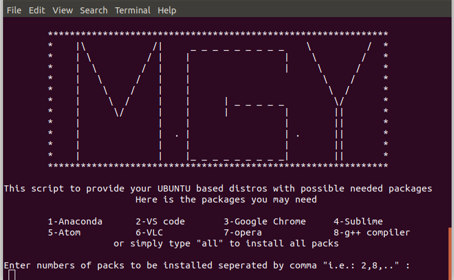

# Packs_Installer
This is a python script used for installing some needed packs for UBUNTU based distros to help you save your time and don't waste it searching for commands to install these packs

## Note that: you have to change directory in terminal to the repo directory or open the terminal in the repo dir, have python3 and have an internet connection to run this program successfully
to check the python version write in your terminal 
```
$ python --version
``` 
you may see something like that as python is installed with linux by default 
```
Python 2.7.15rc1

```
If Python 3.x.x exist instead of Python 2.x.x so you can **skip step 1** and just go for step 2 briefly.

## Step 1
* open the terminal in the repo directory
* write in the terminal:
```
$ bash py3_installer
```
* write the password and just wait for installing python 3 "if enter needed just press it"
* to make a double check write the following command again
```
$ python --version
```
 if you see python 3.x.x so you have made python3 as a default interpreter. 
## Step 2
* write in the terminal 
```
$ python commands.py
```
* now you will see something like that 

### **Congracts!, You are ready to install any pack available in the script**   